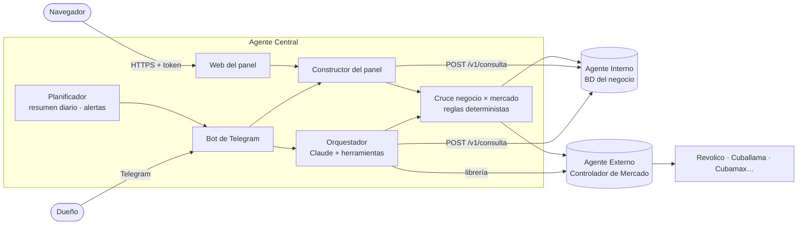

# Arquitectura del Agente Central

## Vista general

## Responsabilidades

| Pieza | Hace | No hace |
|---|---|---|
| Agente Interno | Mide el negocio con 12 herramientas de solo lectura sobre su BD. | No conoce el mercado. |
| Agente Externo | Mide el mercado con un motor determinista (precios, oferta, tendencias, señales, confianza). | No decide ni evalúa la rentabilidad del negocio. |
| **Agente Central** | Enruta las preguntas, cruza ambas fuentes, propone decisiones, genera el panel y habla con el dueño. | No ejecuta acciones ni recalcula las cifras de los subagentes. |

## Integración con los subagentes

**Agente Interno** — contrato HTTP v1.0 (`docs/contratos/*.schema.json`, copia de
`Agente-Controlador-de-Negocio/docs/especificacion/08_contrato_orquestador.md`):
- `type: report` para resúmenes rápidos (`/negocio`, herramienta `informe_negocio`).
- `type: tool` para datos exactos (panel, `herramienta_negocio`, cruce). Es la vía principal: determinista y barata.
- `type: question` solo para preguntas que ninguna herramienta cubre (`pregunta_negocio`).
- El cliente nunca lanza excepciones de red: devuelve `status: error` y el panel lo muestra como aviso.

**Agente Externo** — librería `controlador-mercado` en el mismo proceso (no expone API HTTP):
- Modo `motor` (por defecto): `MarketAnalyzer` sobre las fuentes autorizadas del perfil. El modelo del Agente Central
  describe el producto (`TargetProduct`) y el motor calcula todo. Sin coste de modelo en el Externo.
- Modo `agente`: además se ofrece la herramienta `consultar_agente_mercado`, que usa `MarketControllerAgent`
  (el Externo especifica el producto y redacta conclusiones con su propio Claude).
- La tasa USD→CUP que se pasa al Externo es la del Agente Interno (elTOQUE), para que negocio y mercado usen la misma.
- Los análisis se guardan en caché (memoria y disco, `mercado.cache_horas`) y las fuentes web se consultan en serie.

## Flujos

**Pregunta del dueño** — Telegram → autorización por ID y límite de uso → orquestador: el modelo elige herramientas
(en paralelo cuando son independientes) → cada herramienta valida sus parámetros y llama al subagente o al cruce →
el modelo redacta con las marcas 📊 💡 ❔ → filtro de salida (sin SQL, claves ni nombres internos) → Telegram → registro.

**Panel** — 12 consultas al Agente Interno en paralelo + por cada producto vigilado: ficha e historial (Interno),
análisis de mercado (Externo) y cruce → JSON (`docs/contrato_panel.md`) → HTML autocontenido con la marca del perfil.
**Un estudio al día**: se hace a `panel.hora_estudio` (o con el primer `/panel` del día, lo que llegue antes), siempre con
consultas nuevas a las webs de mercado, y se reutiliza el resto del día, también tras reiniciar el servicio (`panel.json`).
`POST /api/panel/actualizar` lo rehace a mano con datos frescos del negocio y el mercado de la caché.

**Avisos** — resumen diario a la hora del perfil (panel recién generado + 4 propuestas principales, sin modelo) y
revisión de alertas urgentes del negocio cada N minutos con plantilla fija, anti-repetición de 24 h, máximo diario y
horas de silencio.

## Decisiones

| Decisión | Motivo |
|---|---|
| Las propuestas salen de reglas deterministas, no del modelo | Son auditables, repetibles y se prueban; el modelo las explica. |
| Precio de mercado en USD equivalentes, deflactando la tasa de cada semana | En Cuba el precio en CUP sube con la tasa; separar ese efecto evita falsas "subidas". |
| Un solo bot (el del Central) | El dueño tiene un único interlocutor; el Interno se despliega sin su bot. |
| Perfil de empresa en YAML + secretos en entorno | Cada cliente se configura sin tocar código; el perfil se versiona sin riesgo. |
| HTML del panel autocontenido | Se envía por Telegram y se abre sin conexión estable (habitual en Cuba). |
| Historial de conversación solo ampliable y fecha en cada mensaje | Mantiene válidos los bloques de razonamiento y permite cachear el system prompt. |
| Fallback del lado del servidor (`fallbacks: "default"`) | Si el modelo rechaza una petición legítima, otro modelo la atiende sin intervención. |
